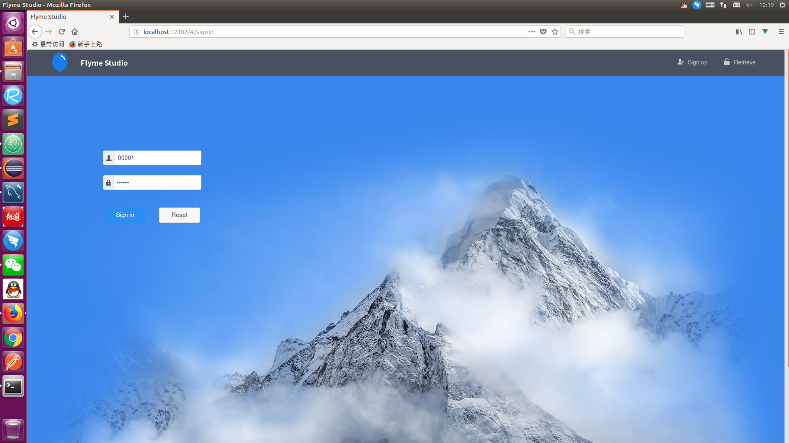
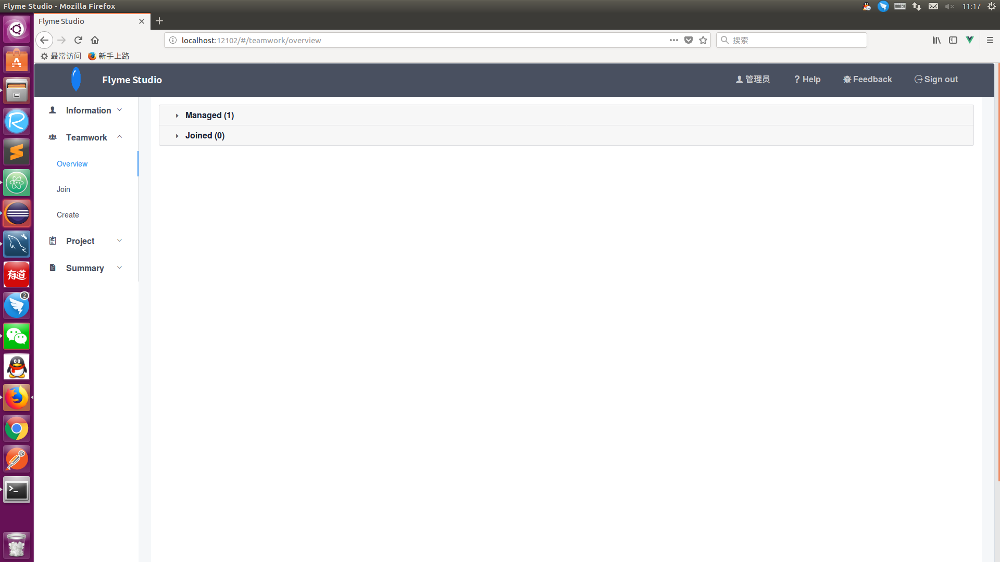

# Doc | [Web](https://github.com/FlymeStudio/FlymeStudio-Web/blob/master/README.md) | [Server](https://github.com/FlymeStudio/FlymeStudio-Server/blob/master/README.md) | [Database](https://github.com/FlymeStudio/FlymeStudio-Database/blob/master/README.md)
---

## [Home](https://github.com/FlymeStudio/FlymeStudio-Doc/blob/master/README.md) | Introduce | [Standard](https://github.com/FlymeStudio/FlymeStudio-Doc/blob/master/standard.md)

---
## Instructions

### *What's FlymeStudio ?*

FlymeStudio是一款工作管理系统，它可以提高团队协同办公效率，具体体现在：

- 先进的团队管理模块：团队管理，成员管理，权限管理，成员工作资料管理等

- 优秀的工作任务模块：任务细化，任务浏览等

- 优秀的工作总结模块（未完成，后续开放）

---
### *How to join FlymeStudio ?*

首页（即登录页）右上角点击Sign up按钮进入注册页。

填写个人信息，如果信息格式不匹配，会提示错误，如果信息已被其他用户使用，包括工号，电话，邮箱，则会提示注册失败。

注册成功则会提示欢迎加入FlymeStudio。

点击右上角的Sign in按钮回到登录页，即可开始使用。

---
### *How to use it ?*

#### **[登录]**

首页输入帐号和密码进行登录操作，帐号包括工号，电话，邮箱。

登录成功后，会跳转到主页。

---
#### **[主页]**

左边导航栏是跳转到不同的模块页面。

顶部导航栏，最左边的蓝色气球可以跳转到Flyme官网，Logo可以跳转到主页。

当用户有新的消息需要查收时，右边的用户名会出现一个红色的提示，点击即可跳转到信息页查收。

点击Help按钮即可跳转到本篇教程。

点击Feedback按钮即可跳转到本项目在Github上的问题页面，用户可以在此进行反馈。

点击Sign out按钮可注销登录并返回登录页。

---
#### **[信息]**

- 信息的浏览页(Overview)

展示用户的个人资料，如果有未处理的消息，也会在此展示。

点击团队名，可预览团队的一些信息，包括团队编号，团队名称，团队创建人，团队人数。

- 信息的修改页(Modify)

用户可以修改自己的部分资料，如果修改后的资料与其他用户冲突，则修改失败。

---
#### **[团队]**

- 团队的浏览页(Overview)

将用户所属团队按照"管理的团队"和"加入的团队"分为两大类。

团队列表的每一项，从上往下分别是：团队名称，对团队的操作按钮，团队编号，团队名，团队创建人，成员管理。

对团队的操作依次为：导出团队工作任务，到处团队工作总结，邀请加入团队，解散团队。

对成员的操作依次为：浏览成员工作任务，浏览成员工作总结，设置成员权限，移除成员。

- 团队的加入页(Join)

根据团队编号或名称搜索出团队，在阅读并同意协议后，才可以加入选择的团队，之后需要等待团队创建人处理消息。

- 团队的创建页(Create)

同样需要先阅读并同意协议，才可以设置团队名称，创建团队。

---
#### **[任务]**

- 任务的浏览页(Overview)

顶部可根据任务的类型进行筛选，然后可以根据完成状况进行二次筛选。

每一个任务项，包含了任务的整体完成度，任务时间，任务标题信息，右上角的两个按钮分别是修改任务，查看详情。

点击修改任务，可以对任务的各种信息进行修改，也可以删除任务。

点击查看详情，可以查看任务的完整信息，包括Markdown格式的正文内容和带有进度的子计划。

- 任务的创建页(Create)

除了子计划是可选的，其他是必填项。

点击Upload按钮可以选择本地的Markdown文档进行上传。

- 任务的查询页(Search)

后期开放

---
#### **[总结]**

后期开放

---
## Feedback

- [Issues](https://github.com/FlymeStudio/FlymeStudio-Doc/issues)
